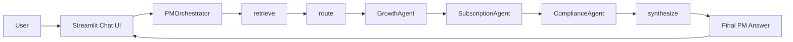
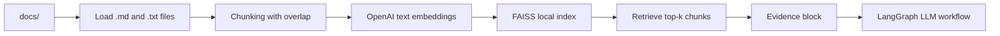
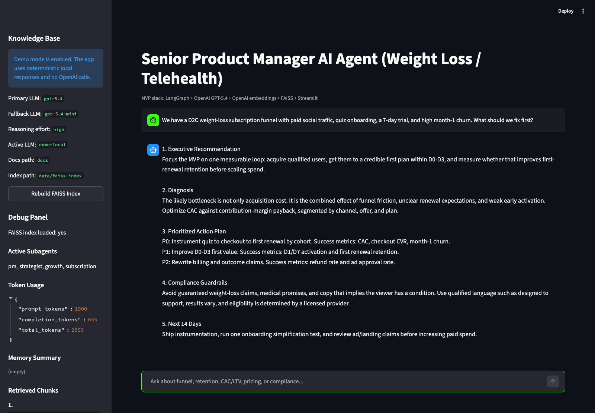
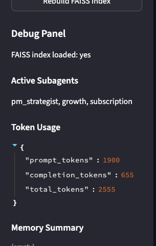
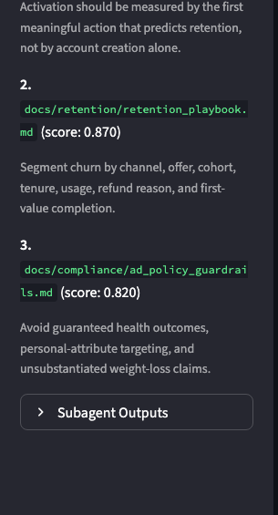
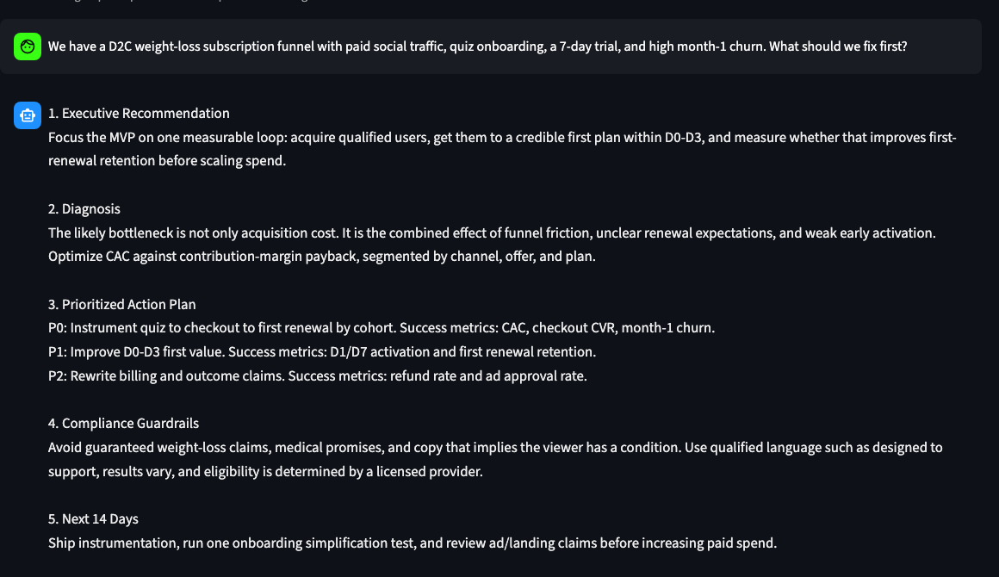

# Senior Product Manager AI Agent

Кратко по-русски: это local-first AI ассистент для анализа D2C/B2C subscription, weight-loss, wellness/nutra и telehealth продуктов. Проект показывает практическую LLM-инженерию: LangGraph workflow, RAG на FAISS, OpenAI embeddings, structured subagent outputs, memory summary, Streamlit UI и debug sidebar.

## Overview

Senior Product Manager AI Agent is a portfolio-grade MVP of a domain-expert assistant for product, growth, retention, and compliance analysis in subscription health businesses.

It is intentionally lightweight: a Python app with a Streamlit chat UI, a deterministic LangGraph workflow, prompt-routed specialist subagents, a local FAISS knowledge base, and optional demo mode that runs without real OpenAI calls.

## Problem

D2C and telehealth subscription teams often need to reason across several connected systems at once:

- acquisition and funnel conversion
- onboarding and activation
- churn, refunds, pricing, LTV, and payback
- ad policy and health-claim risk
- product strategy tradeoffs under incomplete data

Generic chatbots tend to give shallow startup advice. This project makes those tradeoffs explicit and forces the assistant to think like a senior PM/operator: metrics first, practical experiments, compliance-aware growth, and clear assumptions.

## Key Features

- LangGraph workflow with explicit `retrieve -> route -> subagents -> synthesize` steps.
- Prompt-routed subagents: `GrowthAgent`, `SubscriptionAgent`, `ComplianceAgent`, and `PMStrategistAgent`.
- FAISS-based local RAG over Markdown knowledge files.
- OpenAI text embeddings via `text-embedding-3-small`.
- OpenAI GPT-5.4 as the default LLM, with configurable fallback.
- Compressed structured JSON outputs from subagents.
- Conversation memory summary to keep context compact.
- Streamlit chat UI with streaming-style response rendering.
- Debug sidebar showing active subagents, retrieved chunks, token usage, memory summary, and raw subagent outputs.
- Demo mode for screenshots, interviews, and local review without API calls.
- Mocked pytest coverage and CI.
- Docker and Docker Compose support.

## Architecture

Full architecture notes live in [docs/architecture.md](docs/architecture.md).



## Agent Workflow

The orchestrator is a simple linear LangGraph graph. The router determines which subagents are active, but execution stays predictable and cheap.

1. `retrieve`: search the local FAISS index for relevant knowledge chunks.
2. `route`: activate subagents based on query keywords.
3. `GrowthAgent`: diagnose funnel, CRO, acquisition, activation, and onboarding.
4. `SubscriptionAgent`: analyze retention, pricing, CAC/LTV, churn, refunds, and payback.
5. `ComplianceAgent`: flag risky health, telehealth, and ad-policy claims when relevant.
6. `PMStrategistAgent`: synthesize evidence and subagent outputs into the final PM answer.

Growth and subscription agents are included by default because most subscription product questions require both conversion and economics reasoning.

## RAG Pipeline



Knowledge folders:

- `docs/growth`: funnel optimization, activation, pricing, paywalls, experimentation.
- `docs/retention`: subscription economics, churn, lifecycle, save flows.
- `docs/compliance`: ad policy, telehealth, health-claim guardrails.
- `docs/competitors`: digital health market and competitor context.

## Tech Stack

- Python
- LangGraph
- OpenAI API
- OpenAI text embeddings
- FAISS local vector store
- Streamlit
- pytest
- Docker / Docker Compose

## Demo

Demo questions are available in [docs/demo_questions.md](docs/demo_questions.md).

Run the app without OpenAI calls:

```bash
DEMO_MODE=true streamlit run app.py
```

Screenshots:


'Main chat UI.'


'Debug sidebar with active subagents.'


'Retrieved chunks.'


'Final answer example.'

## Setup

Create and activate a virtual environment:

```bash
python -m venv .venv
source .venv/bin/activate
```

Install dependencies:

```bash
python -m pip install --upgrade pip
python -m pip install -r requirements.txt
```

Create local environment config:

```bash
cp .env.example .env
```

Set your OpenAI key in `.env`:

```bash
OPENAI_API_KEY=your_key_here
OPENAI_MODEL=gpt-5.4
OPENAI_FALLBACK_MODEL=gpt-5.4-mini
OPENAI_REASONING_EFFORT=high
```

If your account does not have access to the default model, replace `OPENAI_MODEL` and `OPENAI_FALLBACK_MODEL` with models available to your OpenAI project.

Start Streamlit:

```bash
streamlit run app.py
```

## Docker Setup

Run in demo mode:

```bash
DEMO_MODE=true docker compose up --build
```

Run with OpenAI:

```bash
cp .env.example .env
# edit .env and set OPENAI_API_KEY
docker compose up --build
```

The Compose setup mounts local `docs/` and `data/` folders:

- `docs/` lets you edit the knowledge base locally.
- `data/` stores the generated FAISS index and chunk store.

Open the UI at:

```text
http://localhost:8501
```

## How to Build FAISS Index

After adding or editing documents under `docs/`, rebuild the local index:

```bash
python scripts/ingest_docs.py
```

Optional external article import:

```bash
python scripts/import_external_articles.py
python scripts/ingest_docs.py
```

Generated index files are written to `data/` and intentionally excluded from git.

## Debug Sidebar

The Streamlit sidebar shows:

- active subagents selected by the router
- retrieved FAISS chunks with similarity scores
- token usage estimates or API usage
- conversation memory summary
- raw structured subagent outputs
- active LLM and fallback model

This is useful for debugging RAG grounding, routing behavior, and answer quality during portfolio demos.

## Tests

Run the mocked test suite:

```bash
pytest
```

Run lightweight eval and stress scripts:

```bash
python scripts/run_evals.py
python scripts/run_stress_tests.py
```

Run everything:

```bash
bash scripts/run_all_quality_checks.sh
```

The automated checks avoid real OpenAI calls and cover chunking, document loading, FAISS/RAG build with fake embeddings, router logic, structured output normalization, memory summary behavior, and settings loading.

## Roadmap

- Add richer retrieval metadata and source summaries.
- Add a small regression eval dataset with expected answer traits.
- Add optional LangGraph Studio trace instructions for deeper graph inspection.
- Add better response formatting controls for long tables.
- Add a saved demo conversation mode.
- Add a small CLI for ingestion and eval commands.

## Known Limitations

- This is an MVP, not a production medical, legal, or compliance system.
- RAG is simple top-k retrieval over local Markdown files.
- FAISS index files are local and must be rebuilt after knowledge-base changes.
- Subagents are prompt-based and sequential, not autonomous planners.
- The debug token panel is approximate when using mocked/demo mode.
- Compliance output is a product-policy aid, not legal or regulatory advice.
- Model availability depends on the user's OpenAI project access.
