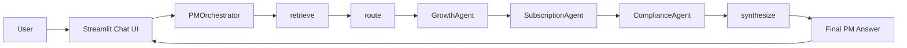
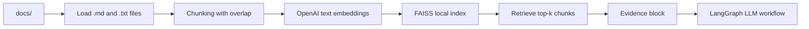

# Architecture

This project is a local-first MVP of a domain-expert AI assistant for D2C/B2C subscription, telehealth, wellness, and weight-loss product analytics. The implementation intentionally avoids heavy infrastructure: Streamlit handles the UI, LangGraph handles the workflow, OpenAI handles LLM and embedding calls, and FAISS stores the local retrieval index.

## Agent Workflow

The graph is intentionally linear. The router determines which subagents are active, but the orchestrator still keeps the execution path predictable and cheap. Growth and subscription analysis are included by default because most product questions in this domain require both funnel and economics thinking.

## RAG Pipeline

The knowledge base is deliberately simple:

- `docs/growth` contains funnel, activation, pricing, paywall, and experimentation material.
- `docs/retention` contains churn, lifecycle, and subscription economics material.
- `docs/compliance` contains ad policy and health-claim guardrails.
- `docs/competitors` contains market and digital health context.

## Main Components

- `app.py`: Streamlit chat UI, debug sidebar, demo mode, and runtime wiring.
- `src/pm_agent/orchestrator.py`: LangGraph workflow, retrieval, routing, subagent calls, synthesis, token aggregation.
- `src/pm_agent/prompts.py`: domain-specific prompts and compressed subagent output contract.
- `src/pm_agent/rag.py`: document loading, chunking, FAISS indexing, and retrieval.
- `src/pm_agent/llm.py`: OpenAI chat/embedding wrapper with compatibility retries and fallback model handling.
- `src/pm_agent/memory.py`: compact conversation summary memory.
- `src/pm_agent/demo.py`: deterministic local demo client used for screenshots and API-key-free demos.

## Design Choices

- Linear graph over autonomous loops keeps cost and debugging predictable.
- Prompt-routed subagents provide domain specialization without agent swarm complexity.
- Structured subagent outputs make synthesis easier to inspect and test.
- Local FAISS keeps the MVP fast, cheap, and simple to run.
- The debug sidebar exposes active subagents, retrieved chunks, token usage, and raw subagent outputs for portfolio review.
